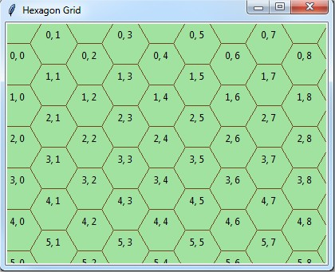

# pytk-hexagon-grid
Draw hexagons grid in a Tkinter Canvas

Work in progress. Hexagon utilities for games in Python's tkinter.

A grid can be displayed with or without grid coordinates on each hexagon (for debug purpose)

## To do :

* add mouse click event
* add neighbours detection
